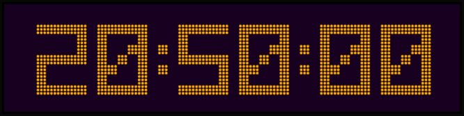
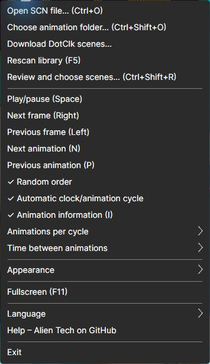

# DMDClock for Windows and ESP32-S3

DMDClock recreates the classic DotClk clock and animation display on Windows and
the original 800x480 Waveshare ESP32-S3-Touch-LCD-7. Choose your platform below;
no developer tools are needed for either user installation.

> **Download:** [latest DMDClock release](https://github.com/DrWize/DMD-Pinball-Clock-Win-x64-and-ESP32/releases/latest)

## Choose your installation

| Windows | ESP32-S3 |
| --- | --- |
|  |  |
| Install the app and optional Windows screensaver. | Flash the supported Waveshare board and prepare its TF card. |
| **[Windows installation guide](docs/INSTALL-WINDOWS.md)** | **[ESP32-S3 installation guide](docs/INSTALL-ESP32.md)** |

### Windows installation

1. Download `DMDClock-*-win-x64-setup.exe` from the
   [latest release](https://github.com/DrWize/DMD-Pinball-Clock-Win-x64-and-ESP32/releases/latest).
2. Run the installer and keep the default per-user installation folder.
3. Start DMDClock from the Start Menu.
4. Right-click the display to download or select a scene library, review scenes,
   and change clock and appearance settings.

The installer includes the required .NET runtime. See the
[Windows installation guide](docs/INSTALL-WINDOWS.md) for upgrades, portable
packages, screensaver setup, and troubleshooting.

### ESP32-S3 installation

The firmware currently targets only the original **Waveshare ESP32-S3-Touch-LCD-7,
800x480, N16R8**. It is not a firmware image for the later 7B board.

1. Download or clone this repository on a Windows PC.
2. Connect the board through its `UART` USB-C port.
3. Run the doctor, then use the single installer/updater script:
   `.\scripts\esp32\Install-DmdClockEsp32.ps1`.
4. Connect it to a 2.4 GHz Wi-Fi network and open the local web remote.
5. Prepare a FAT32 TF card if you want to use the original DotClk scene library.

The [ESP32-S3 installation guide](docs/INSTALL-ESP32.md) gives the exact commands,
first-boot flow, SD-card layout, recovery steps, and security notes.

## What is included

### Windows

- 128x32 four-bit DotClk `.scn` playback with clock, date, masks, and original timing
- automatic, sequential, or random playback and a shared Scene Reviewer selection
- classic, gradient, plasma, raster, and C64-inspired colour themes
- optional Classic, theme-derived, or dual-colour Hot-core dots
- normal application, fullscreen mode, and optional Windows screensaver
- persistent settings, structured logs, and SCN compatibility reports

### ESP32-S3

- native ESP-IDF firmware for the supported 800x480 Waveshare board
- clock, date, SCN playback from TF card, touch controls, and web remote
- Basic, Gradient, Raster, and Plasma themes
- Wi-Fi/NTP, MQTT and Home Assistant discovery, diagnostics, and recovery access point
- local settings backup on the TF card with NVS fallback

Original `.scn` animations are not included in Windows packages or production
firmware. Windows can download the original DotClk scene pack in the app; ESP32
users can prepare a card with the supplied script. You may also use your own
compatible `.scn` files.

## User data and privacy

Windows settings, the library index, scene decisions, and logs are stored under
`%LOCALAPPDATA%\DmdClock\`. Scene files remain outside the executable. Normal
playback and the Scene Reviewer run locally and do not send scene or preference
data to an AI service.

ESP32 Wi-Fi credentials are stored locally on the device. Its web remote is HTTP
on the local network and has no login, so use it only on a trusted LAN. The setup
guides explain storage, backup, and recovery in more detail.

## Guides

- [Windows installation](docs/INSTALL-WINDOWS.md)
- [Complete Windows user setup](docs/USER-SETUP.md)
- [ESP32-S3 installation and TF-card setup](docs/INSTALL-ESP32.md)
- [Settings reference](docs/SETTINGS.md)
- [ESP32-S3 roadmap](docs/ESP32-S3-ROADMAP.md)

## Development

Build commands, tests, release packaging, firmware workflows, and Git guidance
have moved to the [developer guide](docs/DEVELOPMENT.md). The active backlog is in
[TODO.md](TODO.md). Windows and ESP32-S3 now include the optional **Hot-core
glow** dot style with Classic warm-centre, theme-derived, and dual-colour modes.

## Acknowledgements

DMDClock is inspired by sigmafx's original DotClk work. Source provenance and
reference links are recorded in [docs/SOURCES.md](docs/SOURCES.md), with resource
hashes in [assets/fonts/README.md](assets/fonts/README.md).

If DMDClock brings a little colour or nostalgia to your day, you can
[buy me a coffee](https://buymeacoffee.com/drwize).
