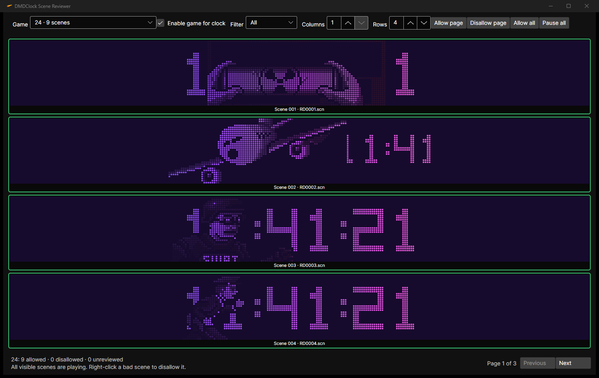

# DMDClock for Windows and ESP32-S3

DMDClock is a Windows x64 clock and animation player for classic DotClk `.scn`
scenes. It recreates a scalable 128×32, four-bit dot-matrix display with clocks,
dates, original scene timing, masks, metadata, configurable colors, and an optional
Windows screensaver.

> ☕ Enjoying DMDClock? If it brings a little color or nostalgia to your day, you
> can [buy me a coffee](https://buymeacoffee.com/drwize). Your support helps me
> keep improving DMDClock and creating more projects like it—thank you!
>
> **Looking for the latest version?**
> [Download DMDClock from the Releases page](https://github.com/DrWize/DMD-Pinball-Clock-Win-x64-and-ESP32/releases).


## Start here

- **Just want the clock and scenes to work?** Follow the
  [simple user setup guide](docs/USER-SETUP.md).
- **Want to understand every option?** Open the
  [settings reference](docs/SETTINGS.md).
- **Want to build or contribute?** Use the setup, scripts, and active roadmap in
  [TODO.md](TODO.md).

## Current status
Main features:

- classic 128×32, four-bit DotClk `.scn` playback;
- storyboard timing, blanking, transparency masks, and clock layers;
- automatic clock/animation cycles with sequential or random playback;
- 12/24-hour time, optional seconds, and four date formats;
- embedded ALTERN8, FISHY, TREK, and TWILIGHT clock/date fonts;
- user-installed `.ttf` and `.otf` support;
- classic, gradient, and C64-inspired DMD color themes;
- recursive scene libraries, incremental rescanning, and optional metadata;
- an in-app downloader for the separately stored original DotClk scene pack;
- a live Scene Reviewer with configurable rows and columns, game controls, and
  per-scene Allowed, Disallowed, and Unreviewed decisions;
- allow-all first-run playback, with whole games or individual bad scenes removable
  from the shared selection;
- one shared playback selection for the normal application and screensaver;
- keyboard controls, persistent settings, fullscreen, and screensaver modes;
- structured logs and SCN compatibility reports.

Animations are not embedded in the package. Download the original DotClk scene
pack from the app, supply your own `.scn` files, or select an existing scene
directory.

## Quick user start

1. Download the latest `DMDClock-*-win-x64-setup.exe` from the
   [`v1.2.0` release](https://github.com/DrWize/DMD-Pinball-Clock-Win-x64-and-ESP32/releases/tag/v1.2.0).
2. Run the installer and keep the default per-user directory.
3. Start DMDClock from the Start Menu.
4. Right-click and choose **Download DotClk scenes…**, or press `Ctrl+Shift+O`
   to select an existing `.scn` folder.
5. Choose **Review and choose scenes…** or press `Ctrl+Shift+R`. Everything starts
   Allowed; disable a game or right-click only scenes you do not want.
6. Right-click the display to configure the clock, scenes, and appearance.

See [DMDClock user setup](docs/USER-SETUP.md) for screenshots, screensaver
installation, upgrades, and troubleshooting.



## Build from source

Requirements:

- Windows 10 or Windows 11 x64
- .NET 10 SDK
- PowerShell 7 recommended

For a complete local workflow—including Debug runs, the reviewer, tests, release
packages, the installer, and Git—see the
[local development guide](docs/DEVELOPMENT.md).

```powershell
dotnet restore DMDClock.sln
dotnet test DMDClock.sln -c Release
.\scripts\Build.ps1 -NoStart
```

The build script creates regular self-contained and standalone single-file Windows
packages:

```text
output\current\win-x64\
output\current\win-x64\DMDClock-<version>-build<build-number>-win-x64-portable.zip
output\current\win-x64-standalone\
output\current\win-x64-standalone\DMDClock-<version>-build<build-number>-win-x64-standalone.zip
output\current\win-x64-installer\DMDClock-<version>-build<build-number>-win-x64-setup.exe
```

It also archives the previous builds, runs the SCN compatibility scan, creates
checksums, and retains the configured number of archives. Read the
[development TODO](TODO.md) before running release scripts because their inputs,
outputs, and side effects are documented there.

## Optional original resources

The application builds and runs without the original DotClk repositories.
Developers can download reference sources and local test resources into the
Git-ignored `external` directory:

```powershell
.\scripts\Get-OriginalResources.ps1
```

See [source references](docs/SOURCES.md) for available resource selections,
provenance, and update safety.

## Runtime data

Preferences, the library index, and logs are stored under:

```text
%LOCALAPPDATA%\DmdClock\
```

Translations remain external under `i18n`; optional OpenType fonts remain under
`fonts`; downloaded scenes remain outside the executable. The verified baseline
`scenes\scene-metadata.json` is included in every package, while review decisions
are stored in `%LOCALAPPDATA%\DmdClock\library-selections.json`. The normal app and
screensaver use the same selection file. The four DotClk clock fonts are embedded.

## Documentation

- [Simple user setup](docs/USER-SETUP.md)
- [Settings reference](docs/SETTINGS.md)
- [Local development without ChatGPT](docs/DEVELOPMENT.md)
- [Standalone installer and roadmap](docs/INSTALLER.md)
- [Development setup and roadmap](TODO.md)
- [SCN format](docs/SCN-FORMAT.md)
- [DotClk font format](docs/DOTCLK-FNT-FORMAT.md)
- [Scene metadata](docs/SCENE-METADATA.md)
- [Source references](docs/SOURCES.md)
- [C64 raster themes](docs/C64-RASTER-THEMES.md)
- [ESP32-S3 roadmap](docs/ESP32-S3-ROADMAP.md)
- [Future DMD Extensions work](docs/FUTURE-DMD-EXTENSIONS.md)

## Project scope

Active development targets the original monochrome DotClk display. Serum, cRom,
full RGB, larger displays, Raspberry Pi, ESP32-S3, physical DMD output, and DMD
Extensions integration are deferred. Audio is outside the project scope.

## Font and resource notes

Inter is distributed under the SIL Open Font License 1.1; see
[`assets/fonts/Inter/OFL-1.1.txt`](assets/fonts/Inter/OFL-1.1.txt).

The embedded `ALTERN8.fnt`, `FISHY.fnt`, `TREK.fnt`, and `TWILIGHT.fnt` files come
from sigmafx's original
[DotClk-Resources repository](https://github.com/sigmafx/DotClk-Resources), source
commit `11211af85a2ade66d05d961839773a05a01bddcc`. They are intentionally kept
inside DMDClock for now so the original clock faces work without another download.
The upstream repository has no explicit license file, so this temporary inclusion
is not a claim of open-source or redistribution rights. Exact hashes are recorded
in [`assets/fonts/README.md`](assets/fonts/README.md).
requests contact for commercial use. Users can install their own compatible
`.ttf`/`.otf` files locally.
