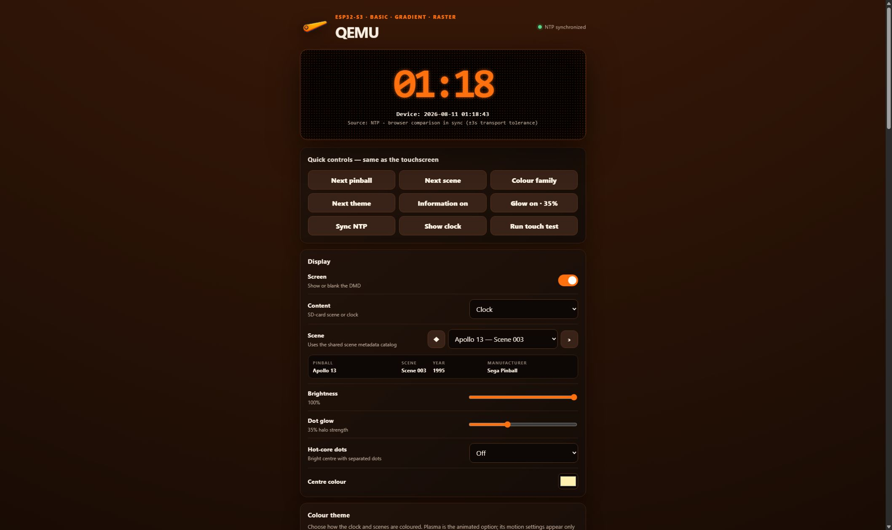

# Install DMDClock on the ESP32-S3 and SD card

This guide and every published DMDClock ESP32 image support only the original
Waveshare `ESP32-S3-Touch-LCD-7`, `ESP32-S3-WROOM-1-N16R8`, with an 800×480
display. The 1024×600 `ESP32-S3-Touch-LCD-7B` is not supported and must not be
flashed with these packages.

## What you need

- the correct Waveshare board;
- a data-capable USB cable connected to the port marked **UART**;
- a FAT32 microSD/TF card with at least 256 MB free;
- a Windows PC with PowerShell 7;
- this repository and its workspace tools.

The [latest release page][latest-release] is the canonical place for published
versions. `Install-DmdClockEsp32.ps1` lists only releases containing a compatible,
hash-verified package for the supported board.

## 1. Download and flash a release

From the repository root, start the single supported installer/updater:

```powershell
.\scripts\esp32\Install-DmdClockEsp32.ps1
```

Its menu lets you:

1. select a stable or preview release containing ESP32 firmware;
2. download and verify its manifest, target ID, ZIP, and individual images;
3. select an application update or complete installation;
4. choose an explicit connected COM port;
5. confirm that the physical board label says `7`, not `7B`; and
6. flash only after typing `FLASH`.

Application updates preserve the bootloader, partition table, NVS/Wi-Fi settings,
and TF card. Complete installation writes the bootloader, partition table, and
application without issuing an erase command, so NVS and the TF card remain
untouched.

Download without flashing:

```powershell
.\scripts\esp32\Install-DmdClockEsp32.ps1 -ReleaseTag v1.3.3 -DownloadOnly
```

## 2. Optional developer Wi-Fi bootstrap and local build

From the repository root, create the one-time local bootstrap header. The password
prompt is masked and the generated header is ignored by Git:

```powershell
.\scripts\esp32\Set-DmdClockBootstrapWifi.ps1 `
  -WifiSsid 'Your 2.4 GHz Wi-Fi name' `
  -Build
```

The ESP32-S3 supports 2.4 GHz Wi-Fi, not a 5 GHz-only network.

Flash that current local build through the same consolidated script:

```powershell
.\scripts\esp32\Doctor.ps1
.\scripts\esp32\Install-DmdClockEsp32.ps1 -LocalBuild -Port COM5 -Monitor
```

Replace `COM5` with the exact connected port reported by the doctor. The flash
script refuses to guess a port. On first boot, the device copies the bootstrap
Wi-Fi credentials into NVS and starts a recovery network named
`DMDClock-xxxx`.

After the home-network connection works, remove the credentials from subsequent
firmware images while preserving NVS:

```powershell
.\scripts\esp32\Clear-DmdClockBootstrapWifi.ps1 -Build
.\scripts\esp32\Install-DmdClockEsp32.ps1 -LocalBuild -Port COM5 `
  -FlashMode Application
```

Do not erase the device during this cleanup flash.

## 3. Prepare the SD card

Insert the FAT32 card into the PC and confirm its drive letter in File Explorer.
The following example uses `J:`:

```powershell
.\scripts\esp32\Prepare-DmdClockSdCard.ps1 J:
```

The script verifies the target, downloads or reuses the original DotClk source,
validates the SCN files, and creates:

```text
J:\dmd\scenes\
J:\dmd\config\scene-metadata.json
J:\dmd\config\dotclk-scenes-manifest.json
```

It is idempotent: rerunning it repairs or refreshes DMDClock files without
formatting the card or deleting unrelated files. Eject the card safely, insert it
into the unpowered ESP32, and power the board again. Firmware creates
`J:\dmd\config\settings.json` after it mounts the card and mirrors every later web
setting change to that file.

## 4. Open the web remote

If home Wi-Fi is not connected:

1. Join `DMDClock-xxxx` from a phone or computer.
2. Use Wi-Fi password `dmdclock`.
3. Open `http://192.168.4.1/`.

When home Wi-Fi has a DHCP lease, open the IP shown on the ESP32 startup screen.
The device name is also displayed, for example `DMDClock-59D9`.



The remote checks GitHub once per page load and displays a link when a newer build
exists. It never flashes firmware automatically.

## Passwords and network security

- The home Wi-Fi password is saved in device NVS. NVS encryption is not currently
  enabled.
- For backup and editability, `/dmd/config/settings.json` also contains the Wi-Fi
  password in plain text. Protect the SD card and any copy of this file.
- Leaving the password box blank in the web remote preserves the saved password.
- `dmdclock` is the WPA2 password for joining the recovery access point. It is
  not a web-page login.
- The web remote currently has no user login and uses HTTP, not HTTPS.
- **LAN-only web access** defaults to on. It accepts only clients on the ESP32's
  current station/AP subnet, loopback, or link-local addresses. It protects
  against accidental routing or port forwarding, but it does not protect against
  another device already on your LAN.

Keep LAN-only access enabled unless another trusted network firewall provides the
boundary. Never forward ESP32 port 80 from the internet.

## Enclosures

Community designs change independently of this project. Verify the mounting holes
and that the model says `ESP32-S3-Touch-LCD-7`, not `7B`, before printing:

- [Waveshare ESP32-S3 7-inch wall-mount case on Printables][printables-case]
- [ESP32-S3-Touch-LCD-7 case on Thingiverse][thingiverse-case]
- [Official Waveshare dimensions and 3D drawing][waveshare-board]

For firmware internals, recovery, QEMU, and diagnostic details, see the
[firmware reference](../firmware/dmdclock-esp32/README.md).

[latest-release]: https://github.com/DrWize/DMD-Pinball-Clock-Win-x64-and-ESP32/releases/latest
[printables-case]: https://www.printables.com/model/1030369-waveshare-esp32-s3-7inch-capacitive-touch-display
[thingiverse-case]: https://www.thingiverse.com/thing:7273339
[waveshare-board]: https://www.waveshare.com/wiki/ESP32-S3-Touch-LCD-7
