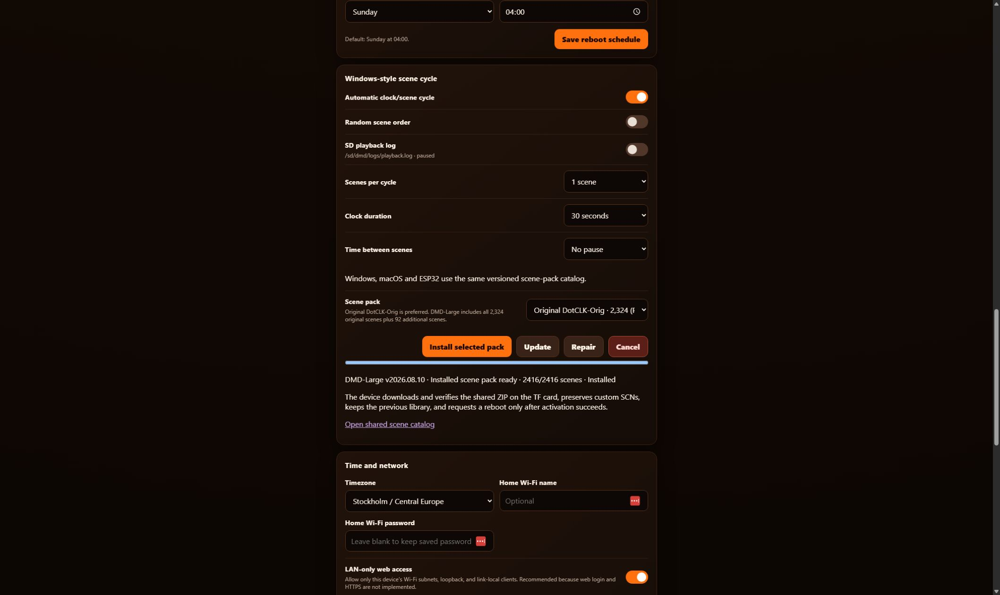
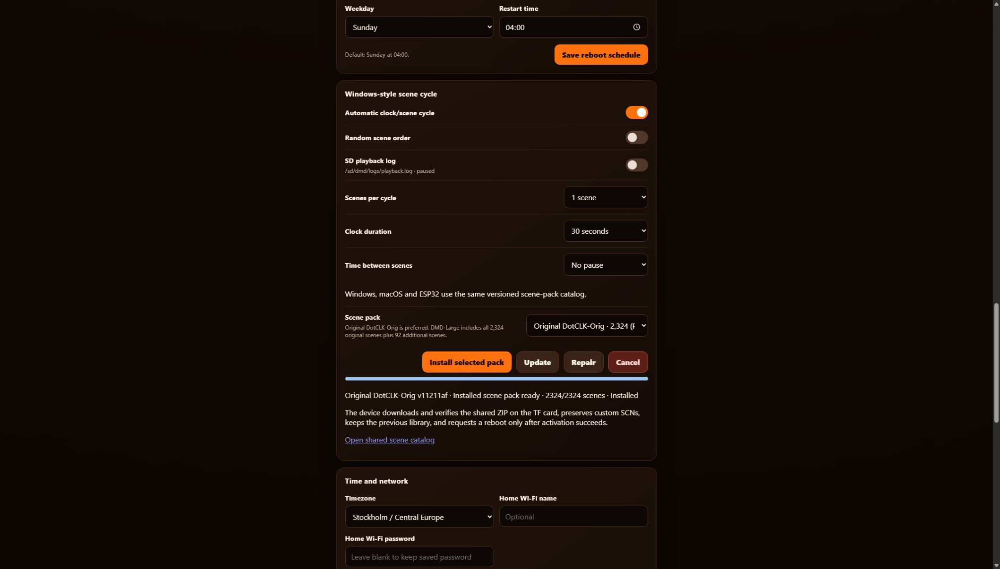

# Install DMDClock on the ESP32-S3 and microSD card

Published DMDClock firmware supports two explicit N16R8 targets: the original
800×480 Waveshare `ESP32-S3-Touch-LCD-7` and the 640×172 Waveshare
`ESP32-S3-Touch-LCD-3.49B` **V2 / Rev1.1**. The 1024×600 7B and 3.49B V1 are
incompatible and must not be flashed with these packages.

The flashing menu filters release manifests by exact target. For 3.49B it also
requires an explicit V2 revision confirmation. Hash-verified official factory
recovery remains available for both 3.49B revisions, but the recovery image must
match the PCB revision and is separate from DMDClock firmware.

Recommended order: download the setup files, prepare the microSD card, insert the
prepared card into the ESP32, flash the firmware, then configure the web remote.
The card does not need a flashed or connected ESP32 and can be finished first.

## Select the correct programming connector

Not every USB or power connector provides a flashing UART. Check the official
interface diagram for the exact model before selecting a COM port:

| Model | Programming connection | Official links |
| --- | --- | --- |
| Waveshare ESP32-S3-Touch-LCD-7 | Use a data-capable cable in the **USB TO UART Type-C** port. | [Product homepage](https://www.waveshare.com/esp32-s3-touch-lcd-7.htm) · [Port diagram and documentation](https://www.waveshare.com/wiki/ESP32-S3-Touch-LCD-7) |
| Waveshare ESP32-S3-Touch-LCD-3.49B | Use the Type-C connector identified for program flashing and log output. Confirm V2 / Rev1.1 before flashing DMDClock. | [Product homepage](https://www.waveshare.com/esp32-s3-touch-lcd-3.49.htm) · [Port diagram and documentation](https://docs.waveshare.com/ESP32-S3-Touch-LCD-3.49) |

If no port is detected, the script repeats the instructions and links for the
selected model. For the 7-inch board it also links the official
[WCH CH343 Windows driver](https://www.wch-ic.com/downloads/CH343SER_EXE.html).

The QEMU development profiles are not flash images. They emulate a classic
ESP32 with 4 MiB PSRAM because the virtual RGB device stalls on the ESP32-S3
machine. The supported N16R8 hardware instead has 8 MiB octal PSRAM. QEMU can
therefore expose memory-pressure problems, but it cannot prove ESP32-S3 timing,
RGB wiring, touch, or physical microSD card behavior.

## What you need

- the correct Waveshare board;
- a data-capable USB cable connected to the model-specific programming
  connector identified above;
- a FAT32 microSD card with at least 256 MB free;
- a Windows 11 x64 PC running PowerShell 7 or newer as `pwsh`;
- this repository or downloaded copies of the three ESP32 entry scripts and their
  shared provisioning module.

The [latest release page][latest-release] is the canonical place for published
versions. `RUNME-Install-DmdClockEsp32.ps1` runs the whole installation in order: stage
every artifact once, prepare the microSD card (or report that it is already up to
date), then flash the board. `Flash-DmdClockEsp32.ps1` asks for the exact board
first, then lists only releases containing a compatible, hash-verified image for
that selection.

## 1. Download the setup scripts

Create or open a clean folder in PowerShell. Download the start script directly
from the latest release:

```powershell
Invoke-WebRequest 'https://github.com/DrWize/DMD-Pinball-Clock-Win-x64-and-ESP32/releases/latest/download/RUNME-Install-DmdClockEsp32.ps1' -OutFile 'RUNME-Install-DmdClockEsp32.ps1'
Unblock-File .\RUNME-Install-DmdClockEsp32.ps1
.\RUNME-Install-DmdClockEsp32.ps1 -CheckRequirements
```

`RUNME-Install-DmdClockEsp32.ps1` is the recommended single entry point: it stages the
selected scene library plus the firmware and flashing tool into one verified
`DmdClockFiles` folder, prepares the microSD card (skipping when it is already up
to date), then flashes the board from the staged payload. It downloads the three
required companion scripts from the canonical `master` branch on first use. The direct
`Flash-DmdClockEsp32.ps1` and `Prepare-DmdClockSdCard.ps1` entry points remain for
fine control and automation. None of the scripts require a repository clone, Git,
Python, .NET, or ESP-IDF.

If you cloned the repository instead, note that end-user entry scripts live in
`scripts\esp32\`, developer tooling in `scripts\esp32\dev\`, and automated tests
in `scripts\esp32\tests\`.

If Windows marks the downloaded scripts as blocked, remove only their downloaded
file markers:

```powershell
Unblock-File -Path .\RUNME-Install-DmdClockEsp32.ps1, .\Flash-DmdClockEsp32.ps1, .\Prepare-DmdClockSdCard.ps1, .\DmdClock.Provisioning.psm1
```

Check the host without creating folders, downloading payloads, or enumerating
hardware:

```powershell
.\RUNME-Install-DmdClockEsp32.ps1 -CheckRequirements
```

### One-command install (recommended)

Connect the FAT32 microSD card and the board, then run:

```powershell
.\RUNME-Install-DmdClockEsp32.ps1 -WhatIf
```

`-WhatIf` plans every phase without downloading or writing anything; it requires
an existing `DmdClockFiles` staging folder (or the repository catalog) so the plan
is real, and phases whose payload is not staged yet are skipped with a `[WHATIF]`
note. Remove `-WhatIf` to run the real installation:

```powershell
.\RUNME-Install-DmdClockEsp32.ps1 -Wizard
```

The installer stages payloads only when they are missing, prepares the microSD
card (reporting "already up to date" when no files are needed), and then flashes
the board. Pass `-Board`, `-FlashMode`, `-Port`, `-DiskNumber`, `-Library`,
`-ReleaseTag`, `-BoardRevision`, `-FactoryRecovery`, or `-ConfirmHardware` to
skip their prompts and drive the installation non-interactively.

### How the installer decides what to run

A full run performs at most four operations, in order:

1. **Stage the scene library** (`Prepare-DmdClockSdCard.ps1 -DownloadOnly`).
2. **Stage firmware and flash tool** (`Flash-DmdClockEsp32.ps1 -DownloadOnly`).
3. **Prepare the microSD card** from the staged payload.
4. **Flash the board** from the staged payload.

Phases 1 and 2 run only when the corresponding payload is missing from the
`DmdClockFiles` staging folder — every file's size and SHA-256 are re-verified
against `staging-manifest.json` — so a second run that finds everything staged
performs only the card and flash phases. The switches steer this flow:

- `-Update` forces phases 1 and 2 to re-check GitHub and re-stage the latest
  library and firmware even when a staged payload exists.
- `-DownloadOnly` stops after the staging phases and is the offline download step
  of the flow; it never touches a card, disk, or COM port.
- `-SkipCard` removes phase 3 for flash-only runs.
- `-Force` accepts the phase 4 `FLASH` confirmation non-interactively (not
  available for factory recovery).
- `-WhatIf` plans only the phases that have a staged payload and skips the rest
  with a `[WHATIF]` note; nothing is downloaded or written.

The installer never inserts the microSD card for you. In the normal order the
card is prepared first (phase 3, card in a PC card reader), inserted into the
ESP32, then flashed (phase 4). When the flash finishes the board resets and
mounts the already-present card.

### Stage once without attached hardware

These commands build one verified `DmdClockFiles` folder. No microSD card or ESP32 is
required or enumerated. The first command stages the selected scene library; the
second adds firmware for both supported boards and official portable esptool.

```powershell
.\Prepare-DmdClockSdCard.ps1 -DownloadOnly `
  -Destination .\DmdClockFiles -Library DmdLarge
.\Flash-DmdClockEsp32.ps1 -DownloadOnly `
  -Destination .\DmdClockFiles
```

Preview either operation by adding `-WhatIf`; no destination is created. The
staging inventory is `DmdClockFiles\staging-manifest.json`, with per-run evidence
under `DmdClockFiles\Logs`.

For the card and flash entry points, `-DryRun` is equivalent to `-WhatIf`. It
creates no log, saved download, temporary extraction, cache, card write, or
flash, and it never opens a COM port. It may read GitHub release metadata and
enumerate disks or COM devices to display the exact plan.

Mutating staging runs write one non-secret evidence log below
`DmdClockFiles\Logs`. microSD synchronization and flashing write theirs below
`%LOCALAPPDATA%\DmdClock\Logs\Provisioning`. Logs finish with an explicit
completed, cancelled, or failed outcome and redact credentials and URL queries.

Consume the verified bundle offline:

```powershell
.\Prepare-DmdClockSdCard.ps1 -DiskNumber 3 -Library DmdLarge `
  -Source .\DmdClockFiles -WhatIf
.\Flash-DmdClockEsp32.ps1 -Board Waveshare7 `
  -Source .\DmdClockFiles -DownloadOnly
```

Remove `-DownloadOnly` from the last command only when the correct board is
connected and you intend to proceed to guarded COM selection and flashing.

### Download once, flash each board offline

The installer can stage everything into one verified `DmdClockFiles` folder with
no microSD card and no connected ESP32:

```powershell
.\RUNME-Install-DmdClockEsp32.ps1 -DownloadOnly
```

It returns after staging the selected scene library plus firmware for both
supported boards and the official portable esptool, and reports the staging
folder (by default `%LOCALAPPDATA%\DmdClock\DmdClockFiles`). Re-check GitHub and
re-stage the latest build at any time:

```powershell
.\RUNME-Install-DmdClockEsp32.ps1 -DownloadOnly -Update
```

When the boards are connected, flash either one from the staged payload without
touching the card:

```powershell
.\RUNME-Install-DmdClockEsp32.ps1 -SkipCard -Board Waveshare7 -FlashMode Full -Port COM5 -Force
.\RUNME-Install-DmdClockEsp32.ps1 -SkipCard -Board Waveshare349B -BoardRevision V2 -ConfirmHardware 3.49B -Port COM6 -Force
```

`-SkipCard` runs only the flash phase; `-Force` accepts the final `FLASH`
confirmation non-interactively (not available for factory recovery). Run once
without `-SkipCard` when the microSD card is ready and the installer will also
prepare the card in the same pass.

### After flashing

1. Confirm the board boots to the clock/startup screen.
2. When the FAT32 microSD card is ready, run the installer once **without**
   `-SkipCard` and with `-DiskNumber N`: it prepares the card from the staged
   payload and reports the firmware as already up to date.
3. If you flashed with `-SkipCard`, insert the prepared card into the
   powered-off board, power it on, then configure timezone and Wi-Fi on the web
   remote (section 4).

## 2. Prepare the microSD card before flashing

The microSD card is independent of the firmware installation. You can prepare it
completely **before connecting or flashing the ESP32**, then insert it into the
board before flashing. This is often the easiest order because the scene download
and full SCN validation can finish while the board remains disconnected.

Creating or formatting the card is outside the scope of DMDClock and its scripts.
Supply an already working FAT32 card. The single authoritative procedure for
checking the card and adding either scene library is the
[Windows microSD card preparation guide](https://github.com/DrWize/DMD-Pinball-Clock-Win-x64-and-ESP32/blob/master/docs/PREPARE-ESP32-SD-CARD.md).
All formatting-tool guidance, including the official Rufus download location,
is maintained there.

Safely eject the prepared card and insert it into the powered-off ESP32 before
flashing. When the flash finishes the board resets and mounts the card. Firmware
creates `/dmd/config/settings.json` after mounting the card and mirrors later
web-setting changes to that file.

The prepared scene library uses the full display area on both supported boards:

| Waveshare 7 — 800×480 | Waveshare 3.49B V2 — 640×172 |
| --- | --- |
|  |  |

## 3. Connect and flash the ESP32-S3

1. Power off the board.
2. Connect a data-capable USB cable to the model-specific programming connector
   described above. Not every USB connector provides UART.
3. Open **Device Manager > Ports (COM & LPT)** and note which COM port appears
   when the board is connected.
4. From the folder containing the downloaded scripts, start the flasher:

```powershell
.\Flash-DmdClockEsp32.ps1
```

5. In the menu:

   1. Select the exact ESP32 display board.
   2. Select a stable or preview release containing an image for that board.
   3. Choose **Complete installation** for a new board, **Application update**
      when updating an existing DMDClock installation, or **Complete installation
      + reset device settings** only when the saved NVS settings must be erased.
   4. Select the COM port identified in Device Manager.
   5. Read the physical label on the board and enter the requested model
      confirmation.
   6. Review the final board, release, flash mode, and port summary.
   7. Type `FLASH` when ready. Uppercase or lowercase is accepted.

6. Keep USB power and the cable connected until the success message appears and
   the board restarts. The script stops before writing if the chip, flash size,
   board confirmation, package hash, or selected port does not match.

The script downloads a verified portable Espressif `esptool` when it is not
already cached under `%LOCALAPPDATA%\DmdClock\tools\esptool`. Python, ESP-IDF,
.NET, Git, and a globally installed flashing tool are not required.

Important hardware, preservation, and confirmation messages are colour-coded so
the supported `7`, unsupported `7B`, selected port/mode, and final write prompt
are easy to distinguish.

For example, a missing-port check stops before flashing and displays:

```text
[FAILED] No usable serial port was detected.

Check the physical USB connection and the selected model's official port
diagram. Open Device Manager > Ports (COM & LPT), then disconnect and reconnect
the board to identify the correct COM port.
```

Application updates preserve the bootloader, partition table, NVS/Wi-Fi settings,
and microSD card. Complete installation writes the bootloader, partition table, and
application without issuing an erase command, so NVS and the microSD card remain
untouched. `-FlashMode FullReset` erases only the NVS settings region and then
performs the complete installation. It rejects `-Force` and requires a final typed
`RESET` confirmation:

```powershell
.\Flash-DmdClockEsp32.ps1 -Board Waveshare349B -FlashMode FullReset `
  -BoardRevision V2 -Port COM5 -ConfirmHardware 3.49B
```

FullReset never performs a full-chip erase and never changes the microSD card.
Delete `dmd\config\settings.json` from the card separately if those saved settings
must also be discarded; otherwise the card can restore them at the next boot.

Download without flashing:

```powershell
.\Flash-DmdClockEsp32.ps1 -ReleaseTag v1.3.4 -DownloadOnly
```

### 3.49B V2 factory qualification

The 3.49B path restores official Waveshare factory firmware so the physical
LCD, touch, and microSD hardware can be qualified before DMDClock support is enabled.
Preview every check without writing:

```powershell
.\Flash-DmdClockEsp32.ps1 -Board Waveshare349B -FactoryRecovery `
  -BoardRevision V2 -Port COM5 -ConfirmHardware 3.49B -WhatIf
```

Remove only `-WhatIf` to perform the recovery. The script still requires a final
case-insensitive `FLASH` confirmation and does not accept `-Force` in factory
recovery mode.

## 4. Open the web remote

The prepared card should already be inserted (it was inserted before flashing);
if it is not, power off the board, insert the card, and power it back on.

If home Wi-Fi is not connected:

1. Join `DMDClock-xxxx` from a phone or computer.
2. Use Wi-Fi password `dmdclock`.
3. Open `http://192.168.4.1/`.

When home Wi-Fi has a DHCP lease, open the IP shown on the ESP32 startup screen.
The device name is also displayed, for example `DMDClock-59D9`.

To add or change the full scene library, power down the ESP32, remove the microSD card,
and use the [Windows microSD card preparation guide](https://github.com/DrWize/DMD-Pinball-Clock-Win-x64-and-ESP32/blob/master/docs/PREPARE-ESP32-SD-CARD.md).
Windows and macOS keep their normal in-app **Download scenes…** workflow for
desktop libraries. Full ESP32 library downloads are prepared on Windows to avoid
competing for the device's display, TLS, and SDMMC memory.

## Web settings guide

The remote is arranged from frequently used display controls at the top to
network, automation, and diagnostics farther down. Changes that say they apply
immediately are saved directly; use the section's **Save** button where one is
shown.

### Quick controls and display


- **Quick controls** mirror the touchscreen actions: advance pinball or scene,
  change colour family/theme, toggle information and glow, synchronize time,
  show the clock, or start the touch test.
- **Screen** blanks or restores the DMD without shutting down the ESP32.
- **Content** selects the clock or a microSD card scene. The scene chooser includes
  pinball, scene, year, and manufacturer metadata when available.
- **Brightness** controls panel output. **Dot glow** controls the halo around
  each DMD dot, while **Hot-core dots** adds a brighter centre and optional
  centre colour.

### Colour themes

Choose Basic, Gradient, Raster, or Plasma, then select a theme within that
family. Theme changes apply immediately. Plasma additionally exposes palette
and motion-loop controls. These examples show the same shared DMD renderer with
two very different settings:

| C64 rainbow | Neon sunset |
| --- | --- |
|  |  |

### Clock, date, font, duration, and orientation

- Select 12- or 24-hour time, seconds visibility, scene-information overlay and
  colour, and any valid DotClk version 1 font found in `/dmd/fonts` when the
  device boots. The card preparation tool installs ALTERN8, FISHY, TREK, and
  TWILIGHT; built-in 5x7 remains available without a card. Reboot after changing
  font files on the card.
- **Fixed clock duration** accepts a whole number from 1 to 600 seconds and
  displays the value in readable minutes and seconds.
- **Orientation** offers fixed 0° or 180° on both boards. The 3.49B V2 also
  offers **Automatic** as the default, using its QMI8658 sensor. Automatic is
  hidden on the Waveshare 7 because that board has no supported orientation
  sensor.

| Clock display | Date display |
| --- | --- |
|  |  |

### Schedules and scene cycling

- **Weekly screen schedule** paints the hours when the panel should be on or
  off. A touchscreen wake is temporary and does not rewrite the schedule.
- **Automatic weekly reboot** provides an optional maintenance restart at the
  selected weekday and time.
- **Windows-style scene cycle** controls automatic scene playback, the number
  of scenes per cycle, and the fixed 1–600 second clock interval between scene
  groups.

### Time, network, Home Assistant, and diagnostics

- **Time and network** selects the region/city timezone, synchronizes browser or
  NTP time, configures home Wi-Fi, and controls LAN-only web access.
- **Home Assistant and MQTT** is optional. It configures local MQTT discovery,
  broker address, credentials, and connection status; normal clock operation
  continues when MQTT is disabled or unavailable.
- The health section reports firmware, display, microSD card, scene index, network,
  NTP, MQTT, memory, touch, and settings status for troubleshooting.

## Time and timezone

On first start, the browser supplies a usable fallback time. In **Time and
network**, choose a region and then a representative city that follows the same
UTC offset and daylight-saving changes as your location. The selector uses 90
current and predicted-future clock-rule groups split across eight regional data
files; `UTC` is always available. The selected time zone is applied and saved
immediately, without using the page's main Save button.

After home Wi-Fi connects, the ESP32 synchronizes automatically with
`pool.ntp.org` and `time.cloudflare.com`. It continues running from its local
timebase during temporary network or NTP outages and resynchronizes when the
connection returns.

The remote checks GitHub once per page load and displays a link when a newer build
exists. It never flashes firmware automatically.

## Passwords and network security

- The home Wi-Fi password is saved in device NVS. NVS encryption is not currently
  enabled.
- For backup and editability, `/dmd/config/settings.json` also contains the Wi-Fi
  password in plain text. Protect the microSD card and any copy of this file.
- Leaving the password box blank in the web remote preserves the saved password.
- `dmdclock` is the WPA2 password for joining the recovery access point. It is
  not a web-page login.
- The web remote currently has no user login and uses HTTP, not HTTPS.
- **LAN-only web access** defaults to on. It accepts only clients on the ESP32's
  current station/AP subnet, loopback, or link-local addresses. It protects
  against accidental routing or port forwarding, but it does not protect against
  another device already on your LAN.

Keep LAN-only access enabled unless another trusted network firewall provides the
boundary. Never forward ESP32 port 80 from the internet.

Repository builds, ESP-IDF flashing, QEMU, and the optional one-time Wi-Fi
bootstrap are intentionally kept out of this end-user installation flow. See
the [ESP32 developer track](DEVELOPMENT.md#optional-esp32-wi-fi-bootstrap-and-local-flashing).

## Enclosures

Community designs change independently of this project. Verify the mounting holes
and that the model says `ESP32-S3-Touch-LCD-7`, not `7B`, before printing:

- [Waveshare ESP32-S3 7-inch wall-mount case on Printables][printables-case]
- [ESP32-S3-Touch-LCD-7 case on Thingiverse][thingiverse-case]
- [Official Waveshare dimensions and 3D drawing][waveshare-board]

For firmware internals, recovery, QEMU, and diagnostic details, see the
[firmware reference](development/esp32/FIRMWARE.md).

[latest-release]: https://github.com/DrWize/DMD-Pinball-Clock-Win-x64-and-ESP32/releases/latest
[printables-case]: https://www.printables.com/model/1030369-waveshare-esp32-s3-7inch-capacitive-touch-display
[thingiverse-case]: https://www.thingiverse.com/thing:7273339
[waveshare-board]: https://www.waveshare.com/wiki/ESP32-S3-Touch-LCD-7
