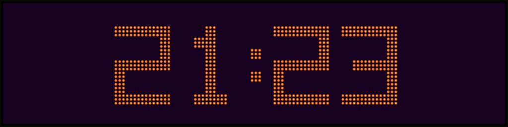
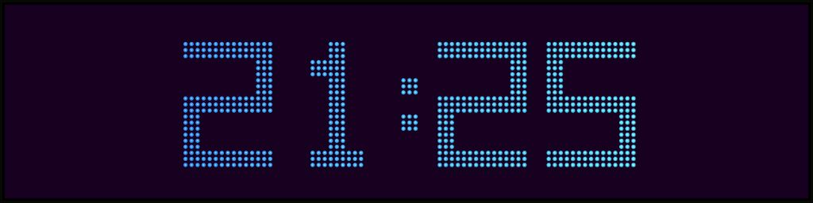
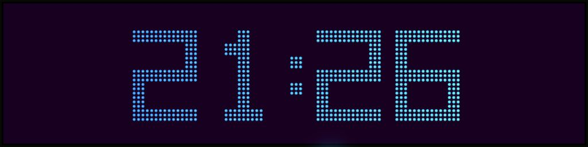

# DMDClock settings reference

Right-click anywhere on the DMD display to open the menu. A check mark means an
option is enabled or selected. The menu stays open while settings are changed and
closes when you click elsewhere or press `Escape`.


Settings are saved automatically to
`%LOCALAPPDATA%\DmdClock\settings.json`. The normal application and screensaver use
the same settings.

## Scene library

| Setting | What it does |
| --- | --- |
| **Open SCN file…** | Opens and plays one `.scn` file without changing the selected library folder. |
| **Choose animation folder…** | Selects and saves the active scene directory. Subdirectories are included. |
| **Download DotClk scenes…** | Downloads the original DotClk scene archive, safely installs only its `.scn` files under `%LOCALAPPDATA%\DmdClock\Scenes\DotClk\`, and selects that library. |
| **Rescan library** | Detects new, changed, moved, removed, and damaged scene files. |
| **Review and choose scenes…** | Opens the live scene wall used to enable games and allow or disallow individual scenes. Shortcut: `Ctrl+Shift+R`. |

DMDClock remembers the selected directory. Valid scenes remain available when
another file is damaged or unsupported.

### Scene Reviewer

The Scene Reviewer groups animations by game and plays every scene on the current
page simultaneously with the real clock compositor. The default `5 × 8` layout
shows 40 live scenes; the Columns and Rows controls independently support values
from 1 through 20.


- On a new installation, every valid scene and game starts **Allowed**.
- Right-click a scene to toggle **Disallowed** and **Allowed**.
- Left-click toggles **Allowed** and **Unreviewed**; left-clicking a Disallowed
  scene restores it to Allowed.
- **Allow page** and **Disallow page** apply one decision to every visible scene.
- **Allow all** resets every game and valid scene to Allowed.
- **Enable game for clock** controls whether that game's allowed scenes can play.
- Filters show all, unreviewed, allowed, or disallowed scenes.
- Page controls cover games with more scenes than the selected grid can display.
- **Pause all** freezes or resumes every visible preview.

Decisions are saved immediately to
`%LOCALAPPDATA%\DmdClock\library-selections.json`. Valid scenes and games are
Allowed by default; disabling a game or marking a scene Disallowed removes it from
playback. Unreviewed and Disallowed scenes do not play. The normal application and
fullscreen screensaver use and reload the same selection file.

Version 1 selection files are migrated once to the allow-all model. Existing
explicitly Disallowed or Unreviewed scene decisions are preserved; previously
implicit game exclusions become enabled and can be disabled again in the reviewer.

Release years are shown beside a game only when the metadata contains one verified
year for that exact game identity. Missing or uncertain years are omitted.

The reviewer is available from the normal app and screensaver configuration mode.
Fullscreen screensaver playback stays control-free but observes the same saved
choices.

## Playback controls

| Setting | What it does |
| --- | --- |
| **Play/pause** | Pauses or resumes the current display and animation timing. |
| **Next frame / Previous frame** | Moves one frame while viewing an animation. |
| **Next animation / Previous animation** | Loads another valid animation from the library. |
| **Random order** | Uses random animation selection. Turn it off for natural filename order. |
| **Automatic clock/animation cycle** | Alternates between the clock and animations automatically. |
| **Animation information** | Shows the game and sequence information briefly when playback begins. |

### Animations per cycle

Choose `1`, `3`, or `5`. This is the number of animations played before DMDClock
returns to the clock.

### Time between animations

Choose no pause, 5, 10, or 30 seconds. During a pause, DMDClock displays the clock
before continuing with the next animation in the same cycle.

## Appearance

### Colors

Color themes change how the same four-bit DMD frame is displayed. They do not alter
the SCN file. The Colors menu summarizes the active family and preset, and every
preset has a color swatch:

- **Basic colors** contains eight solid-dot presets plus a custom color.
- **Plasma** contains eight animated four-color palettes, a custom palette, and
  speed controls.
- **Gradient themes** contains eight horizontal two-color gradients.
- **Raster themes** contains sixteen fixed, C64-inspired vertical raster patterns.

The Background submenu makes background behavior explicit:

- **Theme default** follows the recommended background for each selected preset.
- **Black** keeps the display background black when presets change.
- **Custom** keeps the selected custom background when presets change.

**Reset custom colors** clears the active custom solid color, returns the background
to Theme default, and changes an active custom Plasma palette to Neon pulse. The
saved custom Plasma color stops are retained for later reuse.

### Brightness

Choose 25%, 50%, 75%, or 100%. Brightness affects the lit dots and glow. It does not
change the stored four-bit frame values.

### Glow

Adds or removes the soft light around each illuminated dot. Individual dots remain
separated in either mode.

### Hot-core glow and dot depth

**Hot-core glow** adds a small bright centre without changing the source frame or
joining neighbouring dots. It has three colour modes:

- **Classic amber** uses the traditional orange body, warm yellow-white core, and
  amber halo regardless of the selected colour theme.
- **Follow theme** keeps the selected Basic, Gradient, Raster, or Plasma colours
  and derives a brighter tinted core from each rendered dot.
- **Dual colour** keeps the selected theme for the dot body and lets you choose an
  independent core colour. **Core colour…** remains available while this mode is
  active.

**Dot depth** controls the small lower-right shadow and upper-left highlight:

- **Flat** preserves the original rendering and is the upgrade-safe default.
- **Subtle** adds restrained physical depth and is the recommended Hot-core pairing.
- **Deep** strengthens the recessed appearance for larger displays.

Brightness and the original 0–15 frame intensity still control the complete dot.
Dim dots receive a smaller, dimmer core than fully lit dots.

| Classic amber | Follow theme | Dual colour |
| --- | --- | --- |
|  |  |  |

### Custom basic color

Choose **Colors > Basic colors > Custom** to open the RGB/hex picker. The custom
choice is shown as a Basic color with its hex value, so the selected family always
matches the rendered display.

### Custom background

Choose **Colors > Background > Custom** to open the RGB/hex picker. The custom
background is retained while switching between Basic, Plasma, Gradient, and Raster
presets.

### Show title bar

Shows or hides the normal Windows title bar. A borderless window can still be moved
by left-dragging the display.

### Display size

- **Increase size/zoom** and `+` increase the window size or fullscreen DMD zoom.
- **Decrease size/zoom** and `-` decrease it.
- **Reset size/zoom** and `0` return the current mode to 100%.

Window size and fullscreen zoom are saved separately in 5% steps.

## Clock

| Setting | What it does |
| --- | --- |
| **Show clock** | Immediately stops animation playback and displays the current time. |
| **Show seconds** | Adds or removes seconds from both 12- and 24-hour clocks. |
| **Clock duration** | Selects 10, 30, or 60 seconds before an automatic animation cycle starts. |
| **Time format** | Selects 24-hour time or 12-hour time with AM/PM. |
| **Font** | Selects the built-in font, an embedded DotClk font, or an installed OpenType font. |

Embedded clock fonts:

- ALTERN8
- FISHY
- TREK
- TWILIGHT

These original `.fnt` files are sourced from sigmafx's
[DotClk-Resources repository](https://github.com/sigmafx/DotClk-Resources) and are
currently embedded in DMDClock. See
[`assets/fonts/README.md`](../assets/fonts/README.md) for the source commit, hashes,
and license-status note.

Optional `.ttf` and `.otf` files can be placed anywhere below the `fonts` directory
beside the executable. Reopen the menu to refresh the font list.

## Date

| Setting | What it does |
| --- | --- |
| **Show date** | Immediately displays the current date. |
| **Date format** | Selects `YYYY-MM-DD`, `DD/MM/YYYY`, `MM/DD/YYYY`, or `DD.MM.YYYY`. |
| **Font** | Selects a date font independently from the clock font. |

All four embedded DotClk fonts work with every date format. DMDClock supplies
dot-matrix separators when an original font does not contain the selected separator.

## Fullscreen

**Fullscreen** or `F11` fills the selected screen. Press `F11` or `Escape` to leave
fullscreen. The DMD remains centered and keeps its 4:1 aspect ratio.

## Language

Select English or Swedish. A complete English translation is embedded in the
application as the default and guaranteed fallback. Translation files in `i18n`
beside the executable override the embedded English strings.

If an external translation is missing, unreadable, or invalid, DMDClock records a
warning in `%LOCALAPPDATA%\DmdClock\logs\dmdclock.log` and continues in English.

## Help and exit

- **Help – Alien Tech on GitHub** opens the project page.
- **Exit** closes the application cleanly.

## Default settings

| Setting | Default |
| --- | --- |
| Automatic cycle | On |
| Playback order | Sequential |
| Clock duration | 30 seconds |
| Animations per cycle | 1 |
| Time between animations | No pause |
| Color theme | Classic orange |
| Brightness | 100% |
| Glow | On |
| Hot-core glow | Off |
| Dot depth | Flat |
| Animation information | On |
| Language | English |
| Time format | 24-hour |
| Seconds | On |
| Date format | `YYYY-MM-DD` |
| Clock/date font | Built-in 5×7 |
| Title bar | On |
| Window/fullscreen size | 100% |
| Games and valid scenes | Allowed |

## Settings reset and backup

Close DMDClock before manually changing its files.

To back up the configuration, copy:

```text
%LOCALAPPDATA%\DmdClock\
```

To reset preferences only, back up and remove `settings.json`. DMDClock creates a
new file with defaults the next time it starts. The scene library can then be chosen
again with `Ctrl+Shift+O`.
