# DMDClock — a classic pinball DMD clock

Turn your computer/esp32 into a retro pinball **Dot Matrix Display (DMD)** clock. It shows the current time with dot-matrix letters and numbers, animated classic-pinball-style scenes on the hour and half hour, and can be fully configured from a web page on your phone or PC.

- **Computer software (Windows / macOS)** runs on your desktop to manage scenes and preferences.
- **Firmware (ESP32)** runs on the board; the microSD card holds the scene library.

**Enjoying DMDClock?** [Buy me a coffee](https://buymeacoffee.com/drwize) to support development.

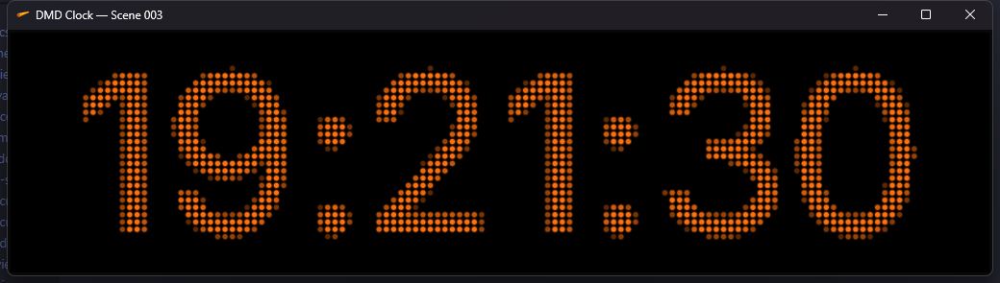

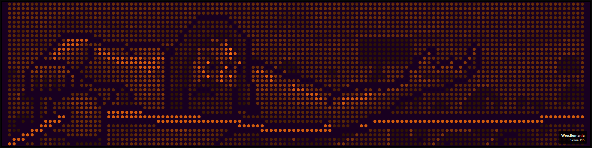

---

## Supported hardware

| Platform / Board | Display | Notes |
| --- | --- | --- |
| **Windows 11** | — | Desktop app for managing scenes & preferences |
| **macOS** | — | Desktop app for managing scenes & preferences (developer preview) |
| Waveshare ESP32-S3-Touch-LCD-7 | 800×480, N16R8 | Supported |
| Waveshare ESP32-S3-Touch-LCD-3.49B V2 / Rev1.1 | 640×172, N16R8 | Supported |


**Stable release:** Here for all platforms  - [Mac/PC and ESP32-S3](https://github.com/DrWize/DMD-Pinball-Clock-Win-x64-and-ESP32/releases/latest)

---

## Install the computer software

### Windows 11

1. Download the **Windows** package from the [latest release](https://github.com/DrWize/DMD-Pinball-Clock-Win-x64-and-ESP32/releases/latest). 
For testing use the standalone executable, which is a self-contained binary that does not require any additional software installed.
2. Extract the archive to a folder of your choice.
3. Run `DMDClock.exe`.

### macOS

> **Developer preview.** The macOS build is unsigned and not notarized. On first launch, right-click the app and choose **Open**, then confirm in the dialog.

1. Download the **macOS** package from the [latest release](https://github.com/DrWize/DMD-Pinball-Clock-Win-x64-and-ESP32/releases/latest).
2. Move `DMDClock.app` to your `Applications` folder.
3. Right-click **Open** → **Open** to bypass Gatekeeper the first time.

Settings are stored in `~/Library/Application Support/DmdClock`.

---

## Install on the ESP32 platform

Do it in this order: **prepare the microSD card → insert the prepared card into the ESP32 → flash the firmware → configure on the web page**.

You need a FAT32 microSD card (256 MB or more) and a card reader, a USB-C data cable, the board, and Windows 11 with PowerShell 7.

**Recommended: one-command installer.** The single installer stages every payload once, prepares the
microSD card (or reports it is already up to date), then flashes the board:

```powershell
.\scripts\esp32\RUNME-Install-DmdClockEsp32.ps1 -WhatIf   # preview the full plan
.\scripts\esp32\RUNME-Install-DmdClockEsp32.ps1 -Wizard   # run the real installation
```

Have both boards but no card handy yet? Stage everything once without any
hardware, then flash each connected board from the staged payload:

```powershell
.\scripts\esp32\RUNME-Install-DmdClockEsp32.ps1 -DownloadOnly         # stage library + both images + esptool
.\scripts\esp32\RUNME-Install-DmdClockEsp32.ps1 -DownloadOnly -Update # re-check GitHub, re-stage latest
.\scripts\esp32\RUNME-Install-DmdClockEsp32.ps1 -SkipCard -Board Waveshare7 -FlashMode Full -Port COM5 -Force
.\scripts\esp32\RUNME-Install-DmdClockEsp32.ps1 -SkipCard -Board Waveshare349B -BoardRevision V2 -ConfirmHardware 3.49B -Port COM6 -Force
```

`-SkipCard` runs only the flash phase (add `-Force` to accept the final `FLASH`
prompt non-interactively). Run without `-SkipCard` once the microSD card is ready
to prepare the card in the same pass.

For how the installer decides what to run, see [Install on the ESP32 — how the installer decides what to run](docs/INSTALL-ESP32.md#how-the-installer-decides-what-to-run).

**Manual alternative:** the two direct entry scripts below show the same flow step by step.

### 1. Prepare the microSD card — from Windows 11

The scene library and settings live on a FAT32 microSD card. Use the included script from **Windows 11** (PowerShell 7 or newer):

1. Insert the microSD card and list physical disks to find its number:

   ```powershell
   .\scripts\esp32\Prepare-DmdClockSdCard.ps1 -ListDisks
   ```

2. Preview the operation (downloads the library, changes nothing) — replace `3` with your verified disk number:

   ```powershell
   .\scripts\esp32\Prepare-DmdClockSdCard.ps1 -DiskNumber 3 -Library DmdLarge -WhatIf
   ```

3. Prepare the card:

   ```powershell
   .\scripts\esp32\Prepare-DmdClockSdCard.ps1 -DiskNumber 3 -Library DmdLarge
   ```

   The script validates every scene and synchronizes the card; it never formats or deletes existing content. Scripts live at [`scripts/esp32/`](scripts/esp32/).

4. Safely eject the prepared card and insert it into the **powered-off** ESP32. Then proceed to flashing.

### 2. Flash the firmware

1. Connect the board with a data-capable USB cable to its USB-C programming port (named UART on the 7" ESP32-S3).
2. Note the COM port in **Device Manager > Ports (COM & LPT)**.
3. Flash the pre-built firmware from the release — replace `COM5` with your port and pick your board (use PowerShell 7.4.x or later):

   ```powershell
   .\scripts\esp32\Flash-DmdClockEsp32.ps1 -Board Waveshare349B -FlashMode Application -BoardRevision V2 -Port COM5 -ConfirmHardware 3.49B
   ```

   ```powershell
   .\scripts\esp32\Flash-DmdClockEsp32.ps1 -Board Waveshare7 -FlashMode Application -Port COM5 -ConfirmHardware 7
   ```

   The script verifies the firmware hash, detects the 16 MB flash, and preserves NVS settings and the microSD card. Leave off `-ConfirmHardware` to review the final prompt interactively. `-FlashMode Application` updates an existing install; `Full` performs a complete install (bootloader, partition table, app). `-BoardRevision` only applies to the 3.49B (V2 vs Rev1.1).

### 3. Configure on the web page

- The prepared card is already inserted, so just power the board on, connect to its Wi-Fi access point, open the built-in web page, and set your time zone, display preferences, and which scene library to play.

> Full firmware and flashing instructions: see the docs in the repository.

---

## Scene libraries

A *scene* is one animated display — a clock, game, or effect — that the board cycles through; the scene library is the full collection stored on the microSD card.

| Library | Scenes | Notes |
| --- | --- | --- |
| **DMD-Large** | 2,416 | Recommended. Download as release [`scene-pack-v2026.08.10`](https://github.com/DrWize/DMD-Pinball-Clock-Win-x64-and-ESP32/releases/tag/scene-pack-v2026.08.10) |
| **DotCLK-Orig** | 2,324 | The original dot-clock scene set |

The scene libraries build on the original DotClk resources by [sigmafx](https://github.com/sigmafx) — the [DotClk-Resources repository](https://github.com/sigmafx/DotClk-Resources) — which DMDClock references and extends with thanks. The original dot-clock project's animations, fonts, and scene format are the basis of the `DotCLK-Orig` library. The `DMD-Large` library contains those original scenes plus the community scene set curated by this project.

---

## Docs

Detailed guides live under `docs/` in this repository:

- [Windows installer & troubleshooting](docs/INSTALL-WINDOWS.md)
- [macOS install](docs/development/macos/ARM64.md)
- [ESP32 firmware build & flashing](docs/INSTALL-ESP32.md)
- [microSD card layout & preparation](docs/PREPARE-ESP32-SD-CARD.md)
- [Settings reference](docs/SETTINGS.md)
- [Development history & changelog](docs/development/DEVELOPMENT-HISTORY.md)

---

## Screenshots

Sample scenes from application.

<table>
  <tr>
    <td></td>
    <td>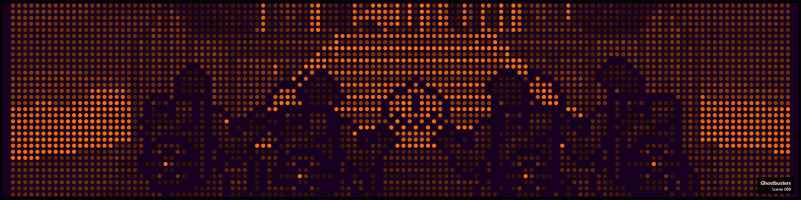</td>
    <td>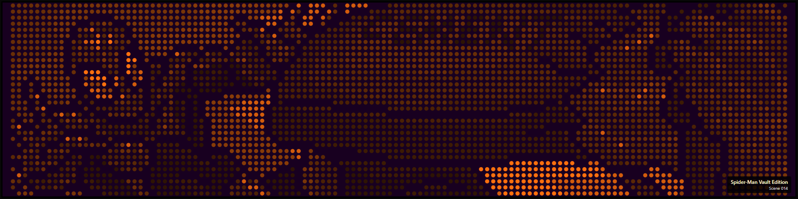</td>
  </tr>
  <tr>
    <td>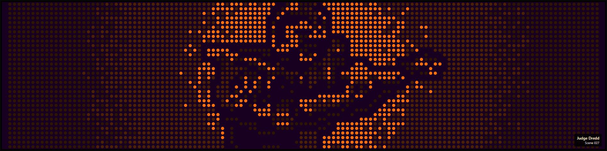</td>
    <td>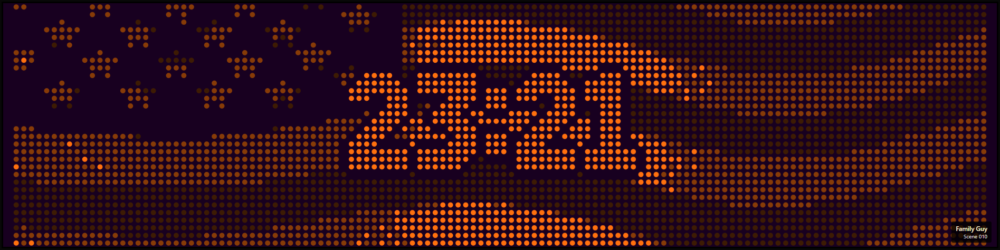</td>
    <td>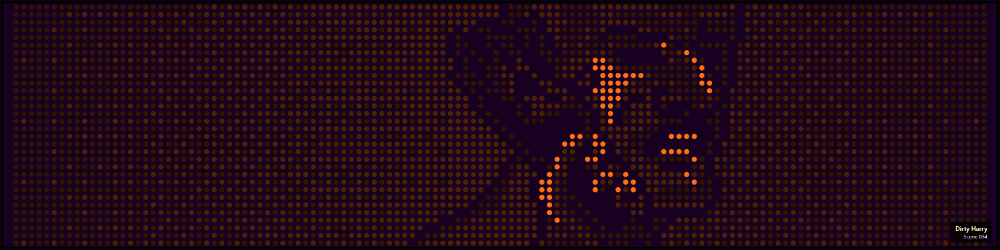</td>
  </tr>
  <tr>
    <td>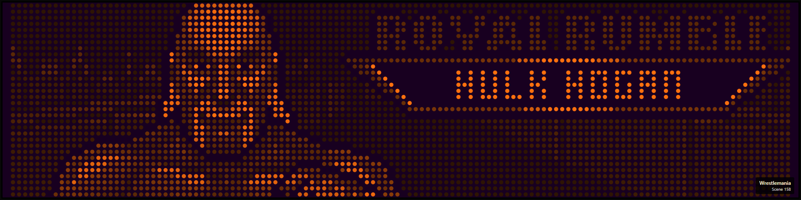</td>
    <td>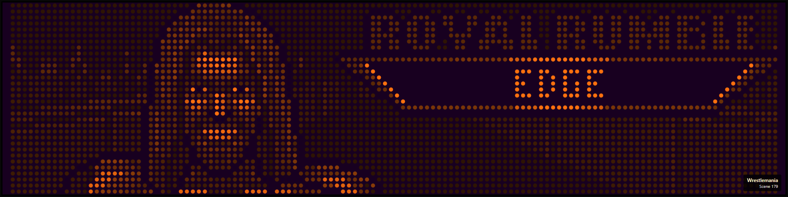</td>
    <td>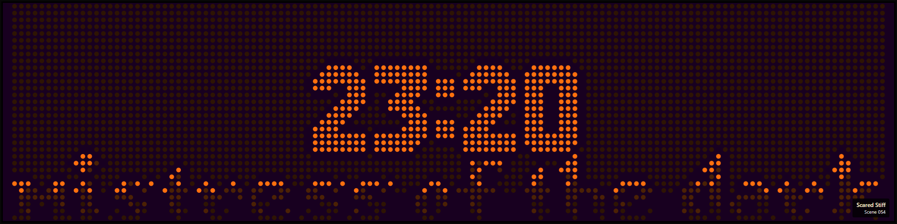</td>
  </tr>
  <tr>
    <td>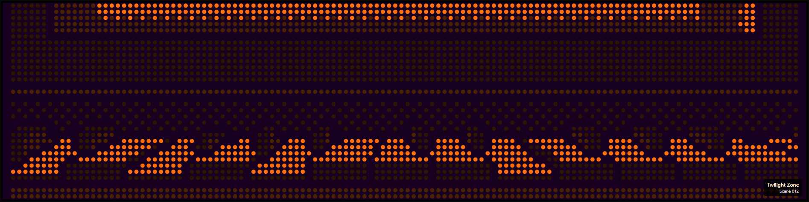</td>
    <td>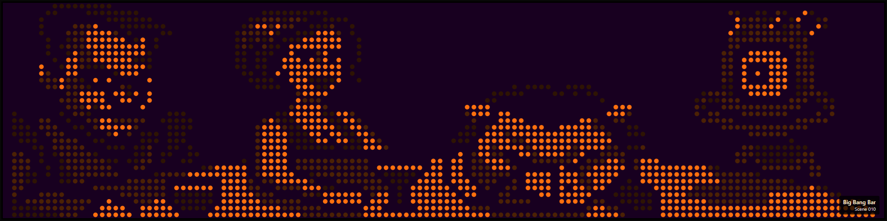</td>
    <td>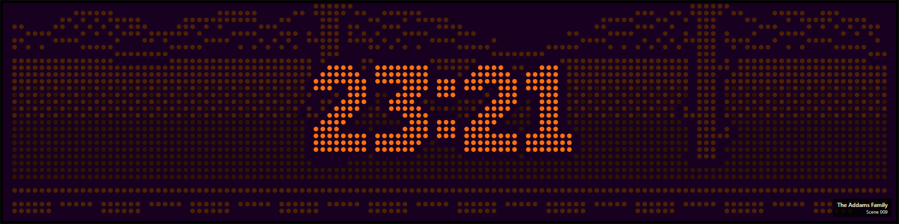</td>
  </tr>
  <tr>
    <td>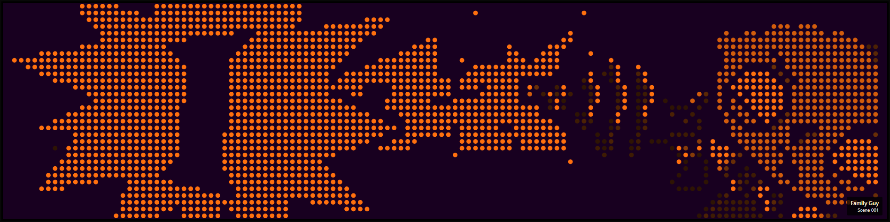</td>
    <td>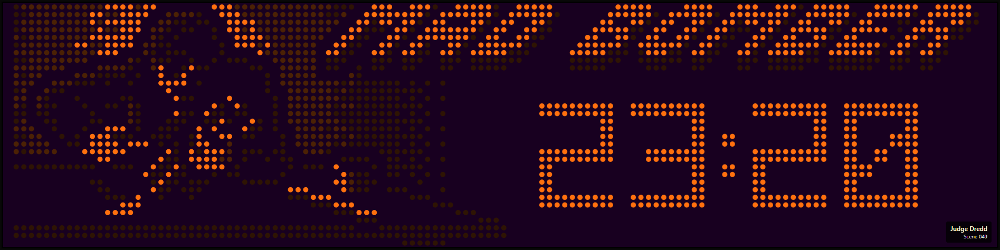</td>
    <td>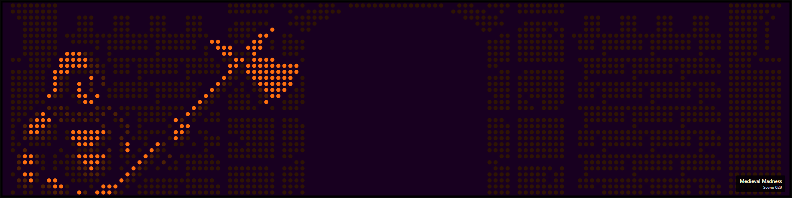</td>
  </tr>
  <tr>
    <td>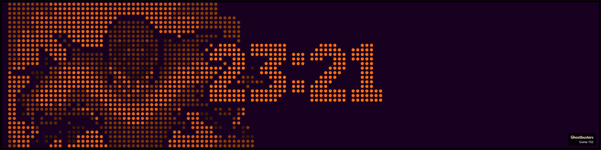</td>
    <td>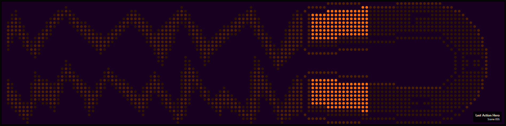</td>
    <td>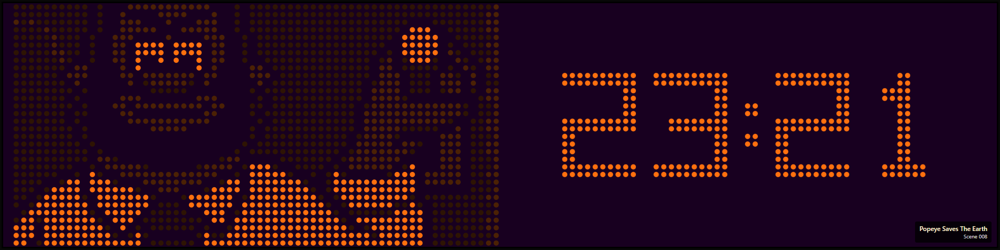</td>
  </tr>
  <tr>
    <td>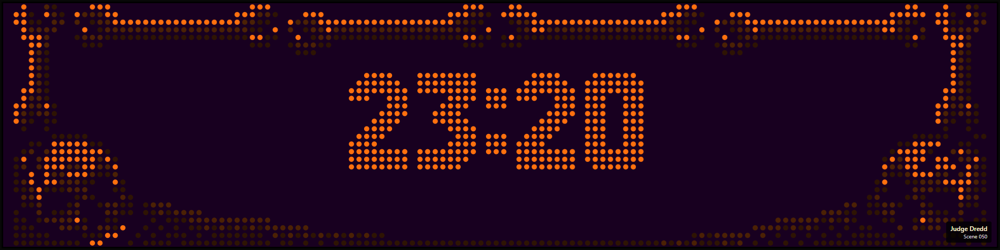</td>
    <td>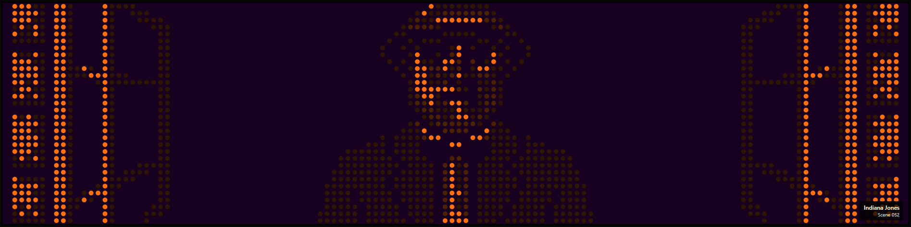</td>
    <td>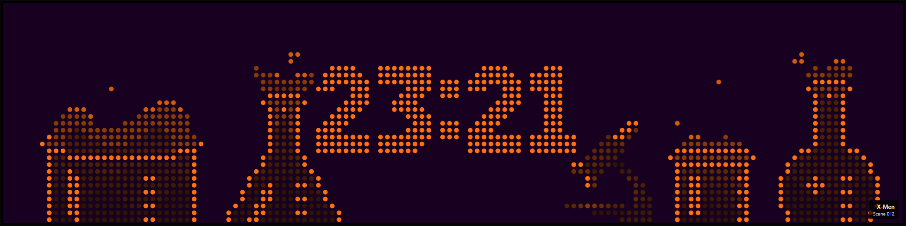</td>
  </tr>
  <tr>
    <td>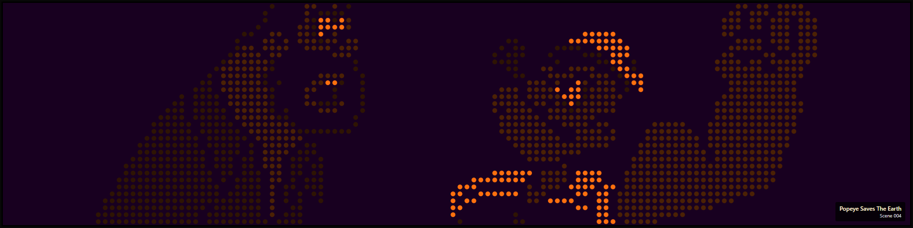</td>
    <td>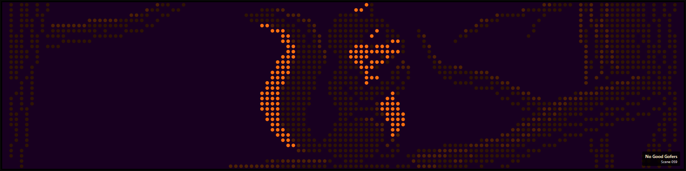</td>
    <td>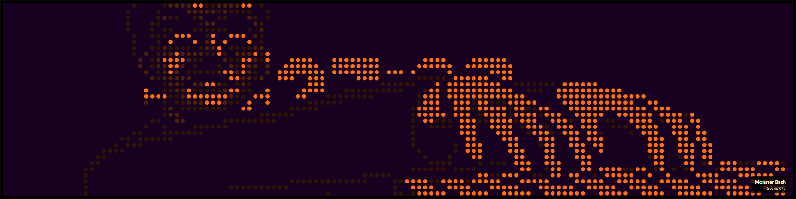</td>
  </tr>
  <tr>
    <td>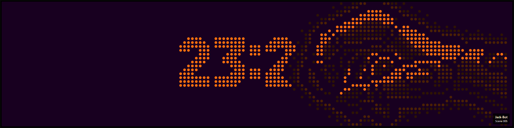</td>
    <td>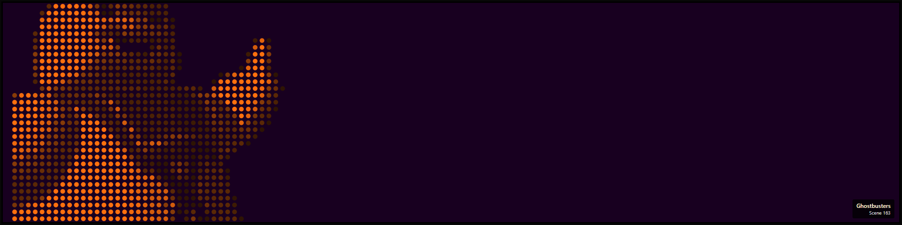</td>
    <td>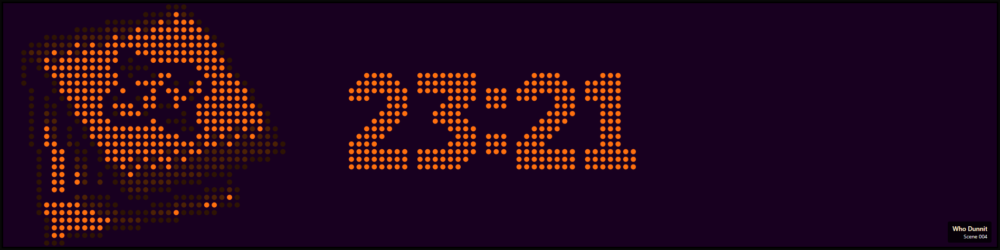</td>
  </tr>
  <tr>
    <td>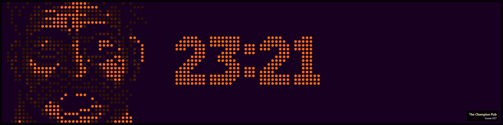</td>
    <td></td>
    <td>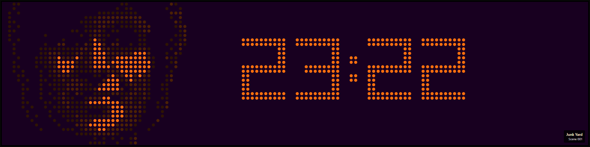</td>
  </tr>
  <tr>
    <td>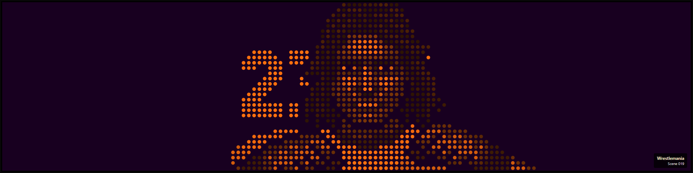</td>
    <td>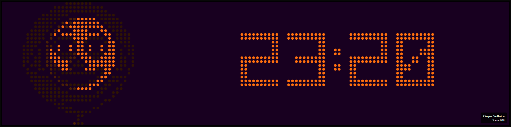</td>
    <td>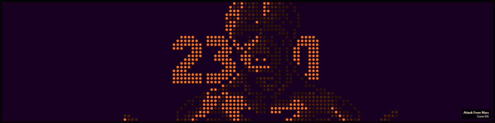</td>
  </tr>
</table>

---

## Support

If DMDClock brings a little colour or nostalgia to your day, you can
[buy me a coffee](https://buymeacoffee.com/drwize) to support development.
